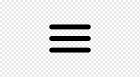

### Elementos Semânticos


## Estrutura de pastas
```
|___ root/
        |___ Imagem
        |___ pages
                |___sobre.html
        |___ samples
            |___ test
        |___src/
            |___ css
        |___index.txt
        |___readme.md

```
# Cores
W3schols (color HTML)

<h1 style="color:green">Names</h1>

<br>
R       G   B<br>
0       0   0 = preto<br>
255   255   255 = branco<br>
255     0   0 = vermelho<br>

+++++++++++++++++++++++++++<br>
FF      0       0   = Vermelho

<h1 style="color:#ff0000">Names</h1>
<h1 style="color:#0000ff">Names</h1>
<h1 style="color:#00ff00">Names</h1>
<h1 style="color:rgb(180,200,84)">RGB</h1>
<h1 style="color:hsl(110,80%,40%)">HSL</h1>

## LENGTH CSS

### PIX
>Medida Angular


### cm, in == polegada, mm
Mapeado para pixels
>1cm = 37.8px <br>
1in = 96px <br>
1mm == 0.1cm == 3.78px

### em
> 1em == 16px == 12pt<br>
> font-size: 14px<br>
> div > div > div (font-size) <br>
> primeira div == 16.8px > segunda div == 20.16px  e terceira div == 24.19px

### rem
base no root (html)

### pt (bom para fazer print)
> 1pt == 1/72 polegadas

### pc (bom para fazer print)
>1pc == 12pt

### %
> img width=50% relativo ao elemento que ele está  contido <br>
> heigth (atenção com %)

### vh, vw --> View port - altura e largura
> 1vh  == 1% da altura da janela de visualização<br>
> 1vw  == 1% da largura da janela de visualização

### vmax, vmin


# 2.4.4 – Estilos de texto
# TEXT
> color(names, hexa, rgb, hsl, gradient)[]

# ALING
- text-align[x]
- text-align-last[x]
- direction [x]
- vertical-align[]

# DECORATION
 - line[x]
 - color[x]
 - style[x]
 - thickness[x]
 - decoration[x]

# SPACING
- text-incident[x]
- letter-spacing[x]
- line-height[x]
- word-spacing[x]
- white-space[x]

# TRANSFORM
- uppercase[x]
- lowercase[x]
- capitalize[x]


---
# 2.4.5 – Trabalhando com seletores
# SELETORES
### Simples
- nomes, ids e classe
### Combinações
- Relação entre elementos
- Adjacente(+), Descendente()
- Seletor filho(>), Seletor vizinho(~)

### Pseudo Elements
- Parte de um elemento
::first-letter
::marker

---
### Pseudo class
- Estado de um elemento
:hover
:checked
:active

### Atributos
- Atributos e valores de um elemento
> input[type=text]

# 2.4.6 – Aplicando prefixos de browser

### Prefixo dos Browsers
- webkit[-webkit] chrome, safari, opera+
- moz[-moz] firefox
- o [-o] opera-
- ms[-ms] internet explorer, edge

# 2.4.7 – Uso de fontes em CSS

## Fontes
---
> Com Serifa (Serifa)

---
<p style="font-size: 30px; font-family:'times new roman'">Lorem Ipsum</p>

- Georgia
- Garamond

---
> Sem Serifa (sans-serif)
<p style="font-size: 30px; font-family: 'Arial'">Lorem Ipsum</p>

- Verdana
- Helvético

> Monoespaçadas(Letras com mesma largura fixa)
- Courier New
- Lucida Console
> Cursivas(imitam a escrita humana)
- Lucida Handwriting
- Brush Script MT
> Fantasia
- Copperplate
- Papyrus


# Box Model
 

 > width | height

 > max-width | min-width

 > margin: 0 0 0 0 (top right booton left)

 > padding: 0 0 0 0 (top right booton left)

 > border-width: 0 0 0 0 (top right booton left)

 > border-radius: 0 0 0 0 (top right booton left)

## Variações

> margin: 0 (todos os lados)

> margin: 0 0 (top/bottom right/left)

<p>Base</p>
<div style="border:solid 4px #fff;
            width:50%;
            margin:20px auto;
            min-width: 200px">
    <div style="width:50%; 
                border:4px solid #fff;
                border-radius: 12px 0 12px 0;
                text-align: center;
                margin: 10px auto; 
                padding: 0 0 0 0">Lorem Ipsum</div>
</div>
<p>Next</p>

<div style="
border:solid 2px red;
min-width:200px;
position:relative;
height:250px;
margin: 30px auto">
        <div style="
        border:solid 1px white;
        width:80%;
        position:relative;
        height:200px;
        margin: 30px auto">
                <div style="
                width:40%;
                border:1px solid #fff;
                text-align: right;
                position: sticky;
                background-color: #fff;
                top:0;
                color: #000;
                padding:0 10px 0 0;">Lorem Ipsum 
                </div>             
        </div>
</div>

> position: sticky

> display: none | inline-block | block

> float

> opacity


# Responsive Design

>Mobile (portraint)
- 320
- 375
- 414

>Mobile (landscape)
- 568
- 667
- 736
- 812

>Tablet (potrait)
- 768
- 834

>Tablet (landscape)
- 1024
- 1112

>Laptop
- 1366
- 1440

>Desktop
- 1680
- 1920
- 2048

---
## Fluid Grids
---
Linhas e colunas que se ajustam mediante os breakpoints

----
## Breakpoints
Ponto de tamanho tela especificados no css associados a janela de visualização (media)

---

### Flexible Images
Verificar sempre o redimensionamento das imagens que é feito em porcentagem.

---

## Media Querie

São especificações css que contém as informações sobre as janelas de visualização.

---

## Viewport
        <meta name="viewport" content="width=device-width, initial-scale=1.0" />

## Overflow
Elementos de tela que estão fora do layout, ou parcialmente fora do layout

---

## fixed Size
Utilizam pixels com largura ou altura

---

## Relative Size
Utilizam medidas com rem ou %

## Mobile First
Técnica de layout ue primeiro anlisa telas menores, para depois pensar em telas mais largas

---

## Hamburguer menu

<div style="background-color:#fff; width:8%; height:30px">
        
</div>
